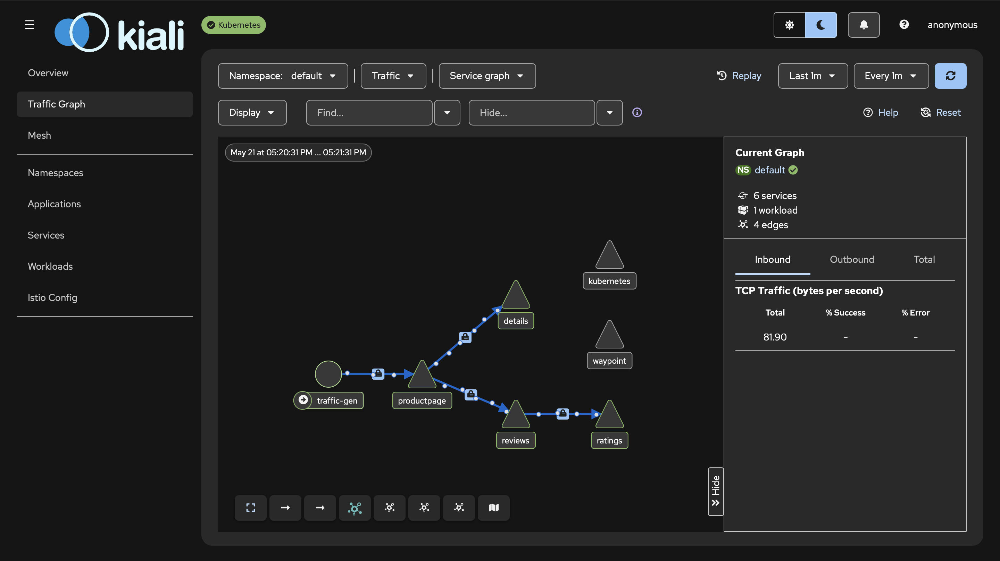
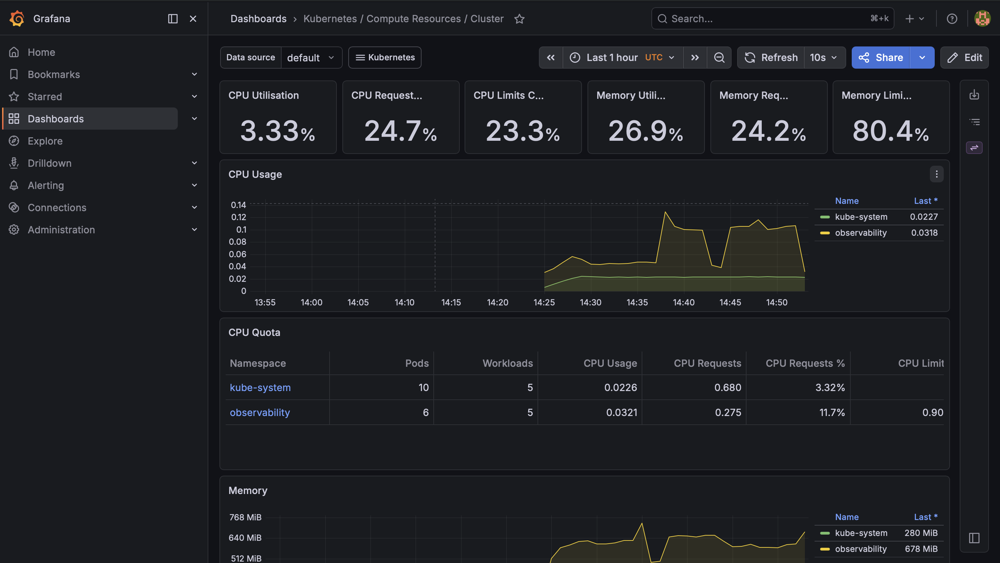

# Secure Biometric Payment Infrastructure

[](https://www.terraform.io/)
[](https://aws.amazon.com/)
[](https://kubernetes.io/)
[](https://istio.io/latest/docs/ambient/)
[](https://github.com/kassvl/biometric-payment-infrastructure/actions)
[](#security--compliance)
[](#license)

> Production-grade AWS infrastructure-as-code for a **biometric payment platform** —
> the kind a regulated European FinTech would run for iris + face authentication
> and card-adjacent workloads. The repository provisions the secure, auditable,
> PCI-DSS-aware platform that the application services would sit on, modeled after
> what a real regulated payment processor needs.

---

## 1. Why this project exists

A biometric payment workload sits in a **regulated processing space** (PSD2,
PCI-DSS, GDPR, EU DORA). Running iris/face matching plus card-adjacent services
requires:

- Strong **network segmentation** so payment-handling pods cannot reach the public internet directly
- **Encryption everywhere**: at rest (KMS), in transit (mTLS via service mesh), in state files
- **Auditable change pipeline**: nothing reaches production without a reviewed, scanned, plan-approved PR
- **Identity-bound** access — no long-lived AWS keys inside the cluster
- **Observability** that is good enough to answer regulator questions in minutes, not days

This repository is the codified version of those requirements.

---

## 2. High-level architecture

```
                        ┌───────────────────────────────────────────────────────┐
                        │                   Route 53 (public)                   │
                        │                   ACM (wildcard TLS)                  │
                        └──────────────────────────┬────────────────────────────┘
                                                   │
                                          ┌────────▼────────┐
                                          │   AWS WAF v2    │
                                          │  (managed RG +  │
                                          │   custom rules) │
                                          └────────┬────────┘
                                                   │
                              ┌────────────────────▼────────────────────┐
                              │           Application Load Balancer     │
                              │           (Ingress, public subnets)     │
                              └────────────────────┬────────────────────┘
                                                   │
   ┌───────────────────────────────────────────────▼────────────────────────────────────────────────┐
   │                                  VPC 10.0.0.0/16  (eu-central-1)                               │
   │                                                                                                │
   │   ┌────────────────────┐     ┌────────────────────┐     ┌────────────────────┐                 │
   │   │ Public  AZ-a       │     │ Private-app AZ-a   │     │ Private-db  AZ-a   │                 │
   │   │ 10.0.1.0/24        │     │ 10.0.10.0/24       │     │ 10.0.20.0/24       │                 │
   │   │ NAT GW + ALB       │     │ EKS nodes + Istio  │     │ Aurora writer      │                 │
   │   └────────────────────┘     └────────────────────┘     └────────────────────┘                 │
   │                                                                                                │
   │   ┌────────────────────┐     ┌────────────────────┐     ┌────────────────────┐                 │
   │   │ Public  AZ-b       │     │ Private-app AZ-b   │     │ Private-db  AZ-b   │                 │
   │   │ 10.0.2.0/24        │     │ 10.0.11.0/24       │     │ 10.0.21.0/24       │                 │
   │   │ NAT GW + ALB       │     │ EKS nodes + Istio  │     │ Aurora reader      │                 │
   │   └────────────────────┘     └────────────────────┘     └────────────────────┘                 │
   │                                                                                                │
   │   VPC Flow Logs ─► CloudWatch ─► (Athena / Security Hub)                                       │
   └────────────────────────────────────────────────────────────────────────────────────────────────┘

   Cross-cutting controls:
     • IRSA (IAM Roles for Service Accounts) — pod-level identity, no static keys
     • External Secrets Operator + AWS Secrets Manager — secret material lives outside Git/etcd
     • GuardDuty + Security Hub — continuous threat detection and CSPM
     • Disaster recovery: warm standby in eu-west-1 (Ireland)
```

---

## 3. Tech stack

| Layer            | Choice                                          | Why                                                                                |
| ---------------- | ----------------------------------------------- | ---------------------------------------------------------------------------------- |
| IaC              | **Terraform 1.9** (modular, S3 + DynamoDB)      | Industry standard for AWS, reviewable plans, state locking prevents collisions     |
| Cloud            | **AWS** (`eu-central-1` primary, `eu-west-1` DR) | Frankfurt = EU data residency, lowest latency to Wrocław, GDPR / Schrems II safe   |
| Orchestration    | **Amazon EKS 1.30** (managed node groups)        | Managed control plane reduces operational burden, full Kubernetes API              |
| Service mesh     | **Istio Ambient (ztunnel + waypoint)**           | mTLS without sidecars → less memory, lower CPU, easier upgrades than classic Istio |
| CI/CD            | **GitHub Actions** + Checkov + tfsec + Trivy     | Native to the host platform, secrets via OIDC, no shared CI runners needed         |
| Observability    | **Prometheus + Grafana + Loki** + CloudWatch     | Open-source stack for metrics/logs, CloudWatch for AWS-native and compliance logs  |
| Secret mgmt      | **AWS Secrets Manager** + External Secrets Operator | Secrets stay in Secrets Manager; cluster pulls them with IRSA — never in Git    |
| Identity         | **IRSA** (IAM Roles for Service Accounts)        | Each pod gets a scoped IAM role via OIDC — eliminates long-lived keys              |
| Edge security    | **AWS WAF v2** + AWS Shield Standard             | OWASP Top 10 + custom rate-limit rules at the ALB                                  |
| DNS / TLS        | **Route 53** + **ACM** (wildcard, auto-renew)    | Auto-renewing certs, DNSSEC option for the apex zone                               |
| Data             | **Aurora PostgreSQL** (Multi-AZ, encrypted)      | Multi-AZ with automatic failover, KMS-encrypted at rest, audit logging on          |
| Cache            | **ElastiCache Redis** (in-transit + at-rest enc) | Session and biometric template cache, never on disk in clear                       |

---

## 4. Repository layout

```
biopay-infra/
├── terraform/
│   ├── bootstrap/            # S3 state bucket + DynamoDB lock (chicken-and-egg solver)
│   ├── modules/
│   │   ├── vpc/              # VPC, subnets (3-tier × 2 AZ), NAT GW per AZ, Flow Logs
│   │   ├── eks/              # Cluster, managed node groups, IRSA, OIDC provider, addons
│   │   ├── rds/              # Aurora PostgreSQL Multi-AZ, parameter groups, KMS, backups
│   │   ├── security/         # SGs, GuardDuty, Security Hub, WAF, KMS keys
│   │   ├── dns-tls/          # Route53 zones, ACM wildcard cert, health checks
│   │   └── observability/    # CloudWatch log groups, dashboards, alarms, SNS topics
│   └── environments/
│       ├── dev/              # Smaller node groups, single-AZ data, cheap
│       └── prod/             # HA, Multi-AZ, full retention, FinTech-grade
├── kubernetes/
│   ├── namespaces/           # Tenant + system namespace declarations
│   ├── istio/                # Ambient mesh installation, waypoint proxies, AuthZ policies
│   ├── workloads/            # Application Helm releases / kustomizations
│   ├── external-secrets/     # ESO setup + ClusterSecretStore for Secrets Manager
│   └── policies/             # OPA/Kyverno policies, NetworkPolicies, PodSecurity
├── .github/workflows/        # terraform-plan, terraform-apply, security-scan
├── monitoring/
│   ├── prometheus/rules/     # Alerting rules (latency SLO, error budget, infra)
│   └── grafana/dashboards/   # JSON dashboards for app + cluster + AWS
├── docs/
│   ├── adr/                  # Architecture Decision Records
│   └── runbooks/             # On-call procedures (DB failover, cluster upgrade, incident IR)
├── CLAUDE.md                 # AI-pair-programmer working context for this repo
└── README.md                 # ← you are here
```

---

## 5. Demo (verified)

The Istio Ambient mesh and observability stack are wired up and running. These are
real screenshots from the development cluster:

### 5.1. Service mesh — Kiali Traffic Graph



Kiali surfacing the live east–west traffic between application services. Lock
icons mark mTLS-encrypted edges (default-deny + PeerAuthentication
strict). The waypoint proxy is visible alongside the data plane, which is the
Istio Ambient pattern (sidecar-less mTLS via ztunnel + waypoint).

- **Namespace:** `default`
- **Services:** 6 — `productpage`, `details`, `reviews`, `ratings`, `traffic-gen`, `kubernetes`
- **Workloads:** 1 (waypoint proxy)
- **Edges:** 4 mTLS-encrypted application edges + traffic-gen → productpage

### 5.2. Cluster compute — Grafana Kubernetes Dashboard



Grafana — *Kubernetes / Compute Resources / Cluster* — fed by Prometheus inside
the `observability` namespace. CPU and memory headroom at the cluster level,
broken down by namespace, with per-namespace request / limit accounting.

- **CPU utilisation:** 3.33%
- **CPU requests committed:** 24.7%
- **Memory utilisation:** 26.9%
- **Memory limits committed:** 80.4%
- **Active namespaces:** `kube-system`, `observability`

---

### 5.3. Reproducibility

Anyone can stand up the same evidence locally. The full reproduction recipe:

```bash
# 1. Bring up the dev cluster (Kind for local; replace with EKS for cloud)
make cluster        # provisions kind cluster + Istio Ambient + observability

# 2. Apply Terraform modules (dev environment)
cd terraform/environments/dev
terraform init
terraform plan -out=tfplan
terraform apply tfplan

# 3. Verify the mesh
kubectl get pods -A                          # all namespaces healthy
istioctl x authz check                       # mTLS posture per workload
kubectl logs -n istio-system -l app=ztunnel  # ztunnel data plane

# 4. Open dashboards
make port-forward-kiali     # http://localhost:20001
make port-forward-grafana   # http://localhost:3000
```

<!-- ASCIINEMA: replace this comment with the cast embed once recorded
     [](https://asciinema.org/a/<ID>)
-->

---

## 6. Security & compliance

This repository is designed with the following frameworks in mind. Every module
ships with controls mapped to a control objective; see each module's README for
the explicit mapping.

- **PCI-DSS v4.0** — network segmentation, encryption, logging, key management
- **GDPR / Schrems II** — EU-only data residency (Frankfurt + Dublin DR)
- **EU DORA** — operational resilience, incident reporting, third-party risk
- **CIS AWS Foundations Benchmark** — automated checks via Security Hub
- **NIST 800-53 (moderate)** — selected control families for change management

CI runs three independent scanners on every PR:

| Scanner    | What it catches                                                      |
| ---------- | -------------------------------------------------------------------- |
| Checkov    | Misconfigured AWS resources (public S3, unencrypted DBs, open SGs)   |
| tfsec      | Terraform-specific security smells, least-privilege IAM violations   |
| Trivy      | Container image CVEs and IaC misconfigs in Dockerfiles + manifests   |

A failing scanner blocks merge. There is no override path that does not require
a Security review approval.

---

## 7. Getting started

> Modules deploy in dependency order: `bootstrap → vpc → security → eks → rds → observability → dns-tls`.

```bash
# Clone
git clone https://github.com/kassvl/biometric-payment-infrastructure.git
cd biometric-payment-infrastructure

# Sign in to AWS (SSO recommended; IAM user with MFA acceptable)
aws sso login --profile biopay-admin

# Bootstrap remote state (one-time per account)
cd terraform/bootstrap
terraform init
terraform plan
terraform apply

# After bootstrap, every other module uses the S3 backend
cd ../environments/dev
terraform init
terraform plan
```

---

## 8. License

This is a **portfolio / educational project** by [@kassvl](https://github.com/kassvl).
The repo models the kind of AWS infrastructure a regulated FinTech with biometric
payment workloads would need: PCI-DSS-aware controls, encrypted everywhere,
auditable change pipeline, identity-bound IAM. It is not affiliated with any
existing payment provider and provisions no production systems.

Released under the [MIT License](LICENSE) for the code and architectural ideas.

---

## 9. Maintainer

[@kassvl](https://github.com/kassvl) — DevOps / Cloud engineering portfolio,
aimed at the Wrocław / Polish FinTech market.
